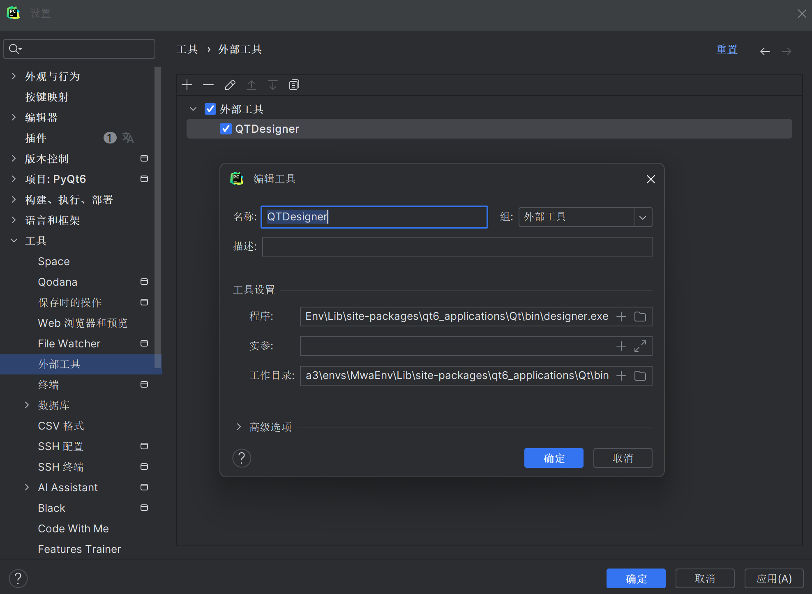
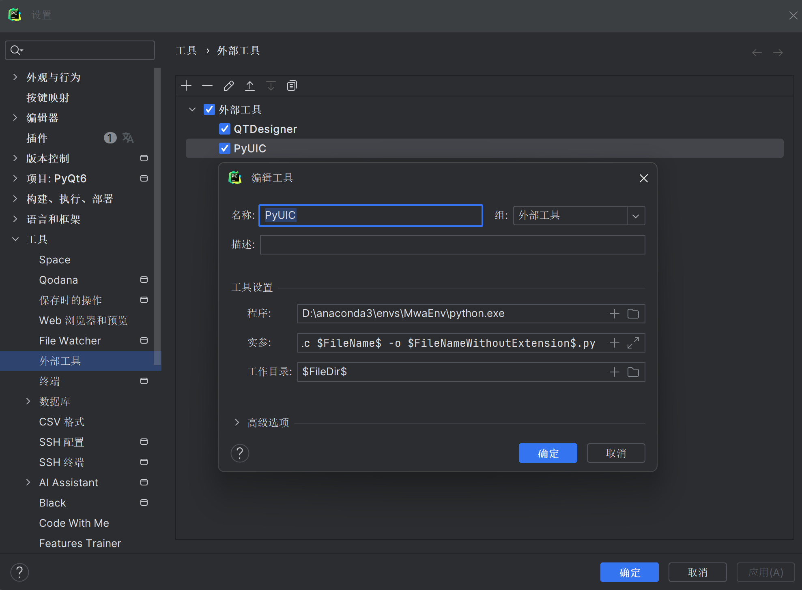
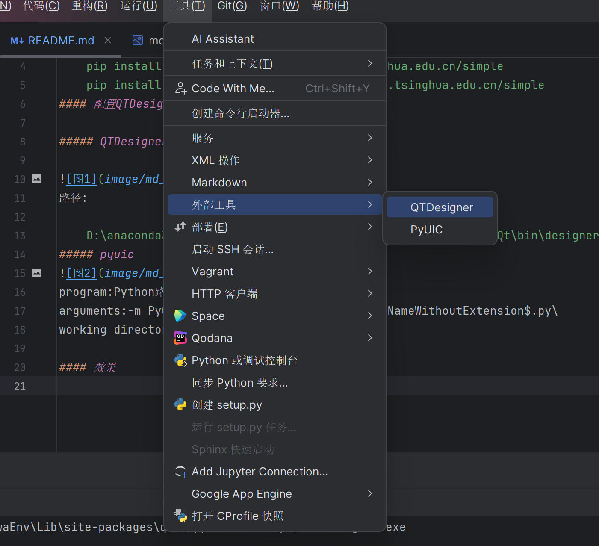
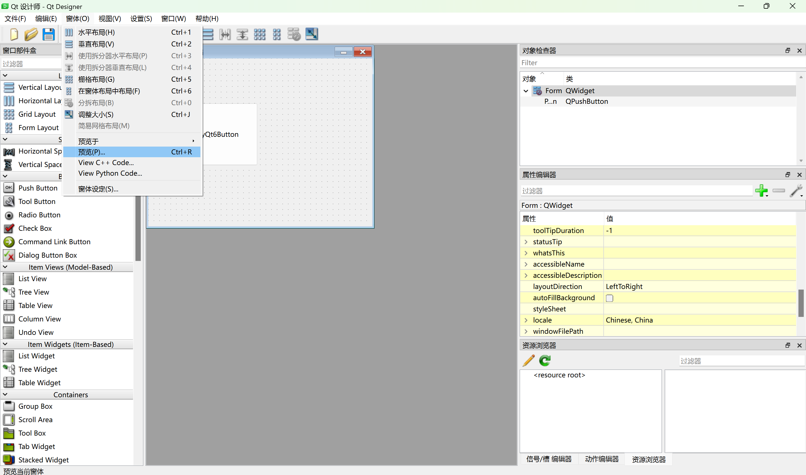
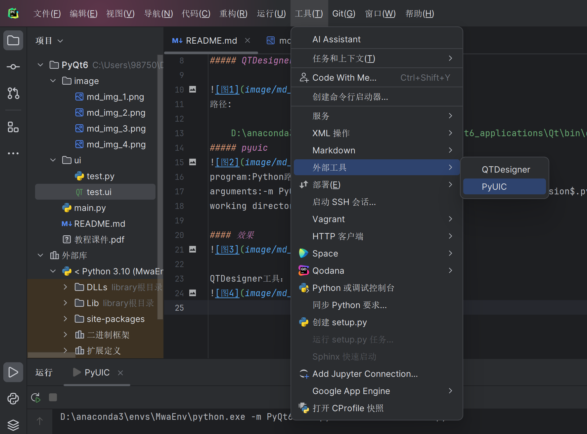

# PyQt6——PyQt6笔记和demo
### 一、安装及配置
#### 安装PyQt6:
    pip install PyQt6 -i https://pypi.tuna.tsinghua.edu.cn/simple
    pip install PyQt6-tools -i https://pypi.tuna.tsinghua.edu.cn/simple
#### 配置QTDesigner和pyuic

##### QTDesigner

路径:

    D:\anaconda3\envs\MwaEnv\Lib\site-packages\qt6_applications\Qt\bin\designer.exe
##### pyuic

program:Python路径\
arguments:-m PyQt6.uic.pyuic $FileName$ -o $FileNameWithoutExtension$.py\
working directory:$FileDir$

#### 效果

QTDesigner工具：

pyuic将ui文件自动变python文件：

### 二、简单窗口代码实现
#### 简单python代码示例

代码("./入门示例/helloworld.py")：

    from PyQt6.QtWidgets import QApplication, QWidget, QLabel
    import sys
    
    app = QApplication(sys.argv)  # 创建应用
    print(sys.argv)   #  sys.argv是列表:[python文件的目录,一些参数,……]
    print(app.arguments())    #同上
    
    window = QWidget()
    window.setWindowTitle("pyqt6实战")
    window.resize(400, 300)  # 窗口大小
    window.show()  # 创建窗口
    window.move(100, 300)  # 窗口位置
    
    label = QLabel()  #
    label.setText("这是标签")
    label.setParent(window)  # 设置父组件
    label.move(80, 80)  # 换个位置
    label.resize(150, 50)  # 大小
    label.setStyleSheet("background-color:yellow;padding:10px") #   设置样式    padding边距
    label.show()
    
    sys.exit(app.exec())  # 开始执行程序，并进行消息等待

#### 展示QTDesigner界面
代码("./入门示例/加载ui文件.py")：

    from PyQt6.QtWidgets import QApplication
    from PyQt6 import uic
    import sys
    
    app = QApplication(sys.argv)
    
    ui = uic.loadUi('./ui_1.ui')
    ui.show()
    
    sys.exit(app.exec())

**工程一般采用QTDesigner设计界面，python代码实现控件逻辑**